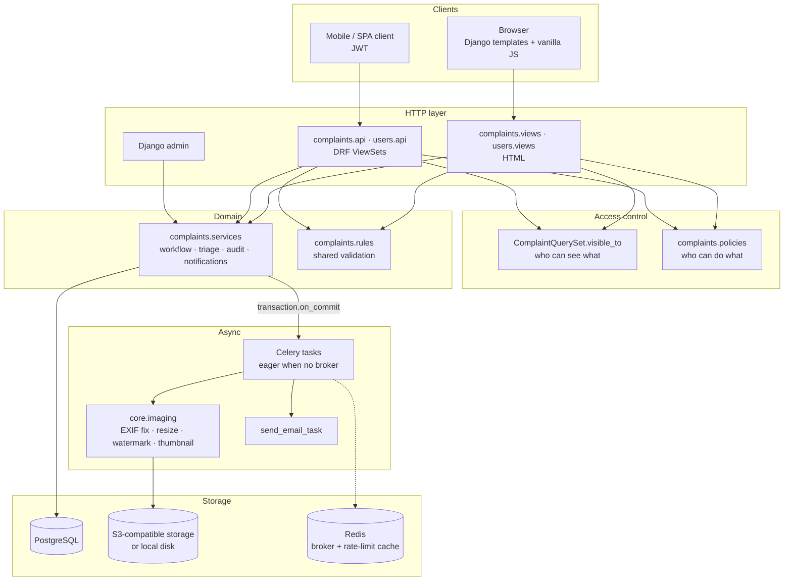

# NagrikSetu

**Report civic issues. Track progress. Build accountable communities.**

NagrikSetu ("citizen bridge") is a civic grievance platform for city wards. Citizens report
potholes, garbage, broken streetlights and other municipal problems with a photo and their
location; ward officials triage and resolve them through an enforced, fully audited workflow.
Everything the web app does is also available through a documented, JWT-secured REST API.

Built with Django 6, Django REST Framework, PostgreSQL, Celery/Redis and a hand-written
HTML/CSS/vanilla-JS front end.

---

## Contents
- [Problem](#problem) · [Solution](#solution) · [Key features](#key-features) · [Screenshots](#screenshots)
- [Architecture](#architecture) · [Tech stack](#tech-stack) · [Project structure](#project-structure)
- [Database design](#database-design) · [Authentication & authorization](#authentication--authorization)
- [API](#api-documentation) · [Local setup](#local-setup) · [Environment variables](#environment-variables)
- [Docker](#docker) · [Deployment](#deployment) · [Testing](#testing)
- [Design decisions](#design-decisions) · [Known limitations](#known-limitations) · [Roadmap](#roadmap)

---

## Problem

Civic complaints are usually raised informally — a phone call, a WhatsApp message, a word
with the local office. There is no shared record of what was reported, where exactly it is,
who is responsible, or what happened to it. Citizens cannot tell whether anyone acted, and
officials have no structured queue to work from.

## Solution

NagrikSetu gives every complaint a permanent record and a controlled lifecycle:

1. A citizen files a report with an issue type, a photo and their browser's location (or a
   landmark when GPS is unavailable).
2. The photo is normalised, stamped with the report number, coordinates and time, stripped
   of camera metadata, and thumbnailed.
3. The complaint lands in the queue of the ward office responsible for it.
4. A corporator (ward official) triages it — priority, assignee, ward — and moves it through
   **Submitted → Acknowledged → In Progress → Resolved / Rejected**. Illegal moves are refused.
5. Every change is written to an append-only activity log, and the reporter is emailed on each
   status change and official reply.
6. Neighbours in the same ward can see the report (without the reporter's identity) and mark
   "this affects me too", so widespread problems surface.

## Key features

**Citizens**
- Guided report form: issue-type picker, drag-and-drop photo upload with preview and client-side
  size/format checks, GPS capture with accuracy, explicit states for denied/unavailable location,
  and a map preview of the captured point
- Dashboard with status counts, recent reports and open issues in their ward
- Complaint page with a progress tracker, photo evidence, location map, discussion thread and
  activity log
- Edit or withdraw a report until the ward office acknowledges it (a new photo is re-processed)
- Ward feed and "this affects me too" upvotes (one per person, enforced by a DB constraint)
- Email verification, status/reply notifications (only to verified addresses), password reset

**Corporators (ward officials)**
- Operations dashboard: open/pending/in-progress/resolved/rejected/high-priority counts,
  search, filters (status, issue, priority, ward, assignee), sorting, pagination, quick status
  changes, issue-type breakdown and recent activity
- Triage: set priority, assign to a corporator serving the ward, transfer between wards — each
  change audited with an optional reason
- Official replies, clearly badged, emailed to the reporter
- Ward-scoped access: a ward corporator sees their ward plus unrouted complaints; a corporator
  with no ward is a city-wide officer

**Platform**
- Map of complaints (Leaflet + OpenStreetMap) with status colours, priority rings, filters,
  sorting, and distinct loading / empty / server-error / offline states
- REST API with OpenAPI 3 docs (Swagger UI and ReDoc), JWT with rotation and revocation,
  consistent error format, filtering, search, ordering, pagination and rate limiting
- Django admin for operations, with workflow fields locked so it cannot bypass the audit trail

## Screenshots

> Add screenshots to `docs/screenshots/` and they will render here.

| Landing | Citizen dashboard | Report form |
| --- | --- | --- |
|  |  |  |

| Complaint detail | Operations dashboard | Map |
| --- | --- | --- |
|  |  |  |

## Architecture

A modular Django monolith with a service layer. HTML views and the REST API are two thin
front doors onto the same domain code.



**Request flow — filing a complaint:** browser → `ComplaintCreateView` (rate-limited) →
`ComplaintForm` (shared `rules.validate_photo`) → `services.create_complaint` (atomic: row +
first audit event) → after commit, `process_complaint_image_task` → `core.imaging` writes the
stamped image and thumbnail and deletes the raw upload.

**Request flow — a status change:** dashboard / detail page / `POST /api/complaints/{id}/status/`
/ admin bulk action → `services.change_status` (row lock, transition table, auto-assignment,
audit row) → after commit, email task.

## Tech stack

| Layer | Technology |
| --- | --- |
| Language / framework | Python 3.13, Django 6.0 |
| API | Django REST Framework, SimpleJWT (rotation + blacklist), django-filter, drf-spectacular |
| Database | PostgreSQL (production, Docker), SQLite (local dev), Django ORM + migrations |
| Background work | Celery 5 with Redis broker; runs eagerly in-process when no broker is set |
| Images | Pillow |
| Media storage | django-storages (S3-compatible: AWS S3, Cloudflare R2, MinIO) or local disk |
| Front end | Django templates, hand-written CSS design system (light/dark), vanilla JS, Leaflet + OpenStreetMap |
| Security | Django's built-in CSP middleware (nonces), SRI-pinned CDN assets, cache-backed rate limiting |
| Serving | Gunicorn, WhiteNoise |
| Ops | Docker / docker-compose, GitHub Actions CI, Render blueprint |

## Project structure

```
NagrikSetu/
├── api/urls.py                 # API routing: router, JWT endpoints, Swagger/ReDoc (with CSP override)
├── complaints/
│   ├── models.py               # Ward, Complaint, StatusHistory (audit), Comment, Upvote + QuerySet
│   ├── policies.py             # can_edit / can_manage / can_comment / can_upvote …
│   ├── rules.py                # validation shared by forms and serializers
│   ├── services.py             # workflow, triage, notifications, reporting
│   ├── views.py  api.py        # HTML views / DRF ViewSets
│   ├── forms.py  serializers.py  filters.py
│   ├── admin.py                # audited admin (workflow fields read-only)
│   ├── templatetags/complaint_extras.py   # icons, status badges, priority indicator
│   └── management/commands/seed_demo.py
├── users/
│   ├── models.py               # CustomUser: role, ward, email_verified, notify_by_email
│   ├── services.py             # email change + signed verification links
│   ├── views.py  api.py  forms.py
├── core/
│   ├── imaging.py              # photo pipeline
│   ├── tasks.py                # Celery tasks
│   ├── permissions.py          # DRF permission classes (delegate to policies)
│   ├── exceptions.py           # uniform API error format
│   ├── ratelimit.py            # sign-in / filing limits for the HTML side
│   ├── middleware.py  logging.py   # request IDs on every log line
│   └── views.py                # /healthz/, error handlers
├── config/settings/            # base · dev · prod · test (fail-closed selection)
├── templates/  static/{css,js,img}/
├── Dockerfile  docker-compose.yml  render.yaml  build.sh
└── .github/workflows/ci.yml
```

## Database design

| Model | Purpose | Key fields & constraints |
| --- | --- | --- |
| `CustomUser` | Citizens and corporators | `role` (indexed), `ward` FK, `email_verified`, `notify_by_email`; **case-insensitive unique email** (partial functional unique index, blank allowed) |
| `Ward` | Unit of accountability | `number` unique |
| `Complaint` | The report | `issue_type`, `status`, `priority` (indexed), `latitude/longitude` (range-validated), `image/thumbnail`, `ward` FK, `assigned_to` FK, `resolved_at`; composite indexes `(status, -created_at)`, `(user, -created_at)`, `(ward, status)` |
| `StatusHistory` | Append-only audit log | `kind` (status / priority / assignment / ward), `old_status`, `new_status`, `note`, `changed_by`; index `(complaint, -created_at)`; not addable, editable or deletable in the admin |
| `Comment` | Reporter ↔ ward office thread | `is_official` derived from the author's role |
| `Upvote` | "This affects me too" | `UniqueConstraint(complaint, user)` |

Allowed status transitions live in one table (`complaints.models.ALLOWED_TRANSITIONS`) and are
enforced only in `services.change_status`, under `SELECT … FOR UPDATE` so concurrent officials
cannot both transition from the same state.

List endpoints compute upvote/comment counts with correlated subqueries (no join fan-out) via
`ComplaintQuerySet.annotated_for(user)`; the detail endpoint prefetches comments and history
with their authors (`with_detail()`), so query count does not grow with thread length.

## Authentication & authorization

- **Web:** Django sessions, POST-only sign-out, `?next=` validated against the host. Sign-in
  (including `/admin/`) is limited to 5 failures per account per address and 30 per address
  per 15 minutes.
- **API:** JWT (`/api/auth/token/`) — 30-minute access tokens, 7-day refresh tokens that rotate
  and are blacklisted after use; `/api/auth/logout/` revokes a refresh token. Session auth
  also works for same-origin calls (CSRF-protected).
- **Roles** are server-assigned. Signup and `/api/auth/me/` cannot change a role, and a
  corporator cannot change their own ward (jurisdiction).
- **Visibility** — one rule, `ComplaintQuerySet.visible_to(user)`, used by every list, detail,
  action, the map feed and the API. Out-of-scope complaints are a 404.
  - Citizens: their own complaints + complaints in their home ward.
  - Ward corporators: their ward + complaints not yet routed to a ward.
  - City-wide corporators (no ward): everything.
- **Actions** on a visible complaint are decided in `complaints/policies.py`: only the reporter
  edits/withdraws (and only while Submitted); only responsible corporators change status,
  priority, assignee or ward; only the reporter and the ward office post in the discussion;
  anyone but the reporter can upvote. Other residents never see the reporter's identity.

## API documentation

Interactive docs are served by the app: **`/api/docs/`** (Swagger UI) and **`/api/redoc/`**;
the raw OpenAPI 3 schema is at `/api/schema/`.

```bash
# Obtain a token pair
curl -X POST http://localhost:8000/api/auth/token/ \
  -H 'Content-Type: application/json' \
  -d '{"username": "asha.patil", "password": "demo1234"}'

# Use it
curl http://localhost:8000/api/complaints/?status=submitted&ordering=-upvote_count \
  -H 'Authorization: Bearer <access>'
```

| Method | Path | Who | Purpose |
| --- | --- | --- | --- |
| `POST` | `/api/auth/register/` | anyone | Create a citizen account (returns tokens) |
| `POST` | `/api/auth/token/` · `/token/refresh/` · `/token/verify/` | anyone | JWT obtain / rotate / verify |
| `POST` | `/api/auth/logout/` | token holder | Revoke a refresh token |
| `GET` `PATCH` | `/api/auth/me/` | signed in | Own profile (role read-only) |
| `GET` `POST` | `/api/complaints/` | signed in | List (visibility-scoped) / file a complaint (multipart for photos) |
| `GET` | `/api/complaints/{id}/` | can see it | Detail with comments, history and a `permissions` block |
| `PATCH` `DELETE` | `/api/complaints/{id}/` | reporter (while Submitted) or responsible corporator | Edit / withdraw — `409` once handling has started |
| `POST` | `/api/complaints/{id}/status/` | responsible corporator | Workflow transition (`400` if not allowed) |
| `POST` | `/api/complaints/{id}/handling/` | responsible corporator | Priority / assignee / ward |
| `GET` `POST` | `/api/complaints/{id}/comments/` | read: can see it; write: reporter or ward office | Discussion |
| `POST` | `/api/complaints/{id}/upvote/` | anyone who can see it except the reporter | Toggle "affects me too" |
| `GET` | `/api/complaints/{id}/history/` | can see it | Audit trail |
| `GET` | `/api/complaints/stats/` | signed in | Counts across the caller's scope (`?ward=`) |
| `GET` | `/api/wards/` | signed in | Ward list |

Filters: `status`, `issue_type`, `priority` (repeatable), `ward`, `is_open`, `mine`,
`assigned_to_me`, `created_after`, `created_before`, `search`, `ordering`, `page`, `page_size`.

**Errors** always have the same shape:

```json
{ "detail": "Cannot move from Resolved to Submitted.", "code": "invalid",
  "errors": { "status": ["Cannot move from Resolved to Submitted."] } }
```

`errors` is present only for validation failures; other errors are `{"detail", "code"}`
(`not_authenticated`, `permission_denied`, `not_found`, `conflict`, `throttled`, …).

## Local setup

Requirements: Python 3.12+ (3.13 recommended).

```bash
git clone <repository-url> && cd NagrikSetu
python -m venv venv
source venv/bin/activate            # Windows: venv\Scripts\activate
pip install -r requirements.txt
cp .env.example .env                # DJANGO_ENV=dev works out of the box
python manage.py migrate
python manage.py seed_demo --reset --complaints 45
python manage.py runserver
```

Open <http://localhost:8000>. The seeder creates 5 Pune wards, 8 citizens and 4 corporators,
all with password `demo1234` (it refuses to run with `DEBUG=False`):

| Account | Role |
| --- | --- |
| `asha.patil` | Citizen, Ward 12 — Kothrud |
| `sunita.more` | Corporator, Ward 12 — Kothrud |
| `ramesh.kale` | City-wide corporator (all wards) |

Create an admin with `python manage.py createsuperuser` and visit `/admin/`. Emails print to
the console in development.

## Environment variables

See [.env.example](.env.example) for the full list. The important ones:

| Variable | Default | Notes |
| --- | --- | --- |
| `DJANGO_ENV` | — | `dev` or `prod`. Unset → `dev` only if `DEBUG=True`, otherwise `prod` |
| `SECRET_KEY` | — | **Required in prod** (≥ 40 chars, not a placeholder) |
| `ALLOWED_HOSTS` | `localhost,127.0.0.1` | Required in prod; `*` is rejected |
| `CSRF_TRUSTED_ORIGINS` | — | e.g. `https://your-domain` |
| `DATABASE_URL` | SQLite file | `postgres://…` in production |
| `CELERY_BROKER_URL` | — | Unset → tasks run inline |
| `REDIS_URL` | — | Shared cache for rate limits across processes |
| `AWS_STORAGE_BUCKET_NAME` + `AWS_*` | — | S3-compatible media storage (R2: also `AWS_S3_ENDPOINT_URL`) |
| `SERVE_MEDIA_FROM_APP` | `False` | Single-instance demos only |
| `EMAIL_BACKEND`, `EMAIL_HOST`, … | console | SMTP for real email |
| `SITE_URL` | `http://localhost:8000` | Absolute links in emails |
| `MAX_UPLOAD_SIZE_MB` / `IMAGE_MAX_PIXELS` | `8` / `40000000` | Photo limits (web and API) |
| `CORS_ALLOWED_ORIGINS` | — | CORS is closed unless listed |

## Docker

`docker-compose.yml` runs the full stack — Gunicorn web, Celery worker, PostgreSQL 17 and
Redis 7 — using the **production** settings module:

```bash
cp .env.example .env
# set SECRET_KEY in .env, e.g. python -c "import secrets; print(secrets.token_urlsafe(64))"
docker compose up --build
docker compose exec web python manage.py createsuperuser
```

Open <http://localhost:8000>. Compose relaxes HTTPS-only redirects/cookies for local HTTP;
never copy those overrides to a public deployment. Compose interpolates `$` in `.env`, so
avoid `$` in `SECRET_KEY` (a `token_urlsafe` key never contains one). The worker and web
containers share a media volume, so photos are processed by the worker, not the request.

## Deployment

The repo includes a [Render blueprint](render.yaml) (web service + managed PostgreSQL),
`build.sh` (install → collectstatic → migrate) and a production `Dockerfile`.

1. Create the blueprint; `SECRET_KEY` is generated for you.
2. Point `ALLOWED_HOSTS`, `CSRF_TRUSTED_ORIGINS` and `SITE_URL` at your domain.
3. Configure object storage (`AWS_*`) — a Render instance's disk is wiped on every deploy.
4. Optionally configure SMTP.
5. Health checks use **`/healthz/`**, which reports database status, task-queue mode and
   media-storage mode (never credentials) and returns 503 when the database is down.

On the free plan no Celery worker is deployed, so photo processing and emails run inline in
the web process; the blueprint shows how to add Redis and a worker. Verify the hardening
locally with:

```bash
DJANGO_ENV=prod SECRET_KEY=<64-char key> ALLOWED_HOSTS=example.com python manage.py check --deploy
```

## Testing

```bash
python manage.py test
```

`manage.py test` selects `config.settings.test` automatically (in-memory SQLite, fast hashing,
eager Celery, locmem email). The suite covers models, the workflow service, HTML views, the
API, permissions and security regressions (IDOR, role escalation, GET logout, open redirect,
upvoting outside your visibility, partial-update validation). GitHub Actions runs system
checks, a migration drift check, `check --deploy` against production settings, the tests, and
a Docker build on every push.

## Design decisions

- **Service layer over fat views.** Status changes come from four places (detail page,
  dashboard, API, admin). Putting transition rules, the audit row and notifications in
  `services.py` means a new entry point cannot skip the audit trail.
- **Two-level access control.** `visible_to()` answers "can you see it?" once, at the queryset,
  so an out-of-scope object is simply absent (404, no information leak). `policies.py`
  answers "may you do this to something you can see?" and is shared by views, DRF permissions,
  serializers (`permissions` block) and templates.
- **Audit log as the single timeline.** Handling changes are events of different `kind`s in
  the same table as status changes, so one ordered history explains a complaint.
- **Optional infrastructure.** Without a broker, Celery runs tasks eagerly, and without a
  bucket, media goes to disk — the project runs with only `runserver`, and gains a worker,
  Redis and object storage through configuration alone. Tasks are enqueued with
  `transaction.on_commit` so workers never see uncommitted rows.
- **Privacy by default.** Photos are re-encoded (EXIF dropped) and the raw upload is deleted;
  neighbours see issues but not reporters; notifications only go to verified emails.
- **Fail-closed configuration.** Forgetting an environment variable produces a startup error,
  not a debug-mode server.
- **No front-end framework.** Server-rendered pages with small, progressive-enhancement scripts;
  everything works without JavaScript except the maps.

## Known limitations

- **Location is self-reported.** Coordinates come from the browser at submission time and can
  be spoofed; the watermark records where and when the report was *filed*, not where the photo
  was taken. It is useful context, not tamper-proof evidence.
- **Ward routing is manual.** There is no GIS boundary data; a complaint gets the reporter's
  home ward (or the only ward, in a single-ward pilot) and officials can transfer it.
- **Deleting a complaint deletes its audit trail.** Only the reporter can withdraw, and only
  before handling starts, but a soft-delete would be more robust.
- **Rate limits are per process** unless `REDIS_URL` is configured.
- **Search** uses `icontains`; large datasets would want PostgreSQL full-text search.
- Not load-tested; no monitoring/alerting integration yet.

## Roadmap

- PostGIS ward boundaries for automatic routing
- Nearby-duplicate detection when filing
- SLA targets and overdue flags per issue type
- Soft delete for complaints; export of the audit log
- PostgreSQL full-text search
- Error monitoring (e.g. Sentry) and structured JSON logs
- Multilingual UI (Marathi, Hindi)

## Contributing

1. Branch from `main`.
2. Keep domain rules in `complaints/services.py` and access rules in `complaints/policies.py`.
3. Add a test for anything you fix — especially permission boundaries.
4. Run `python manage.py test` and `python manage.py check` before opening a PR.

## License

No license has been chosen yet. Add a `LICENSE` file before publishing.
