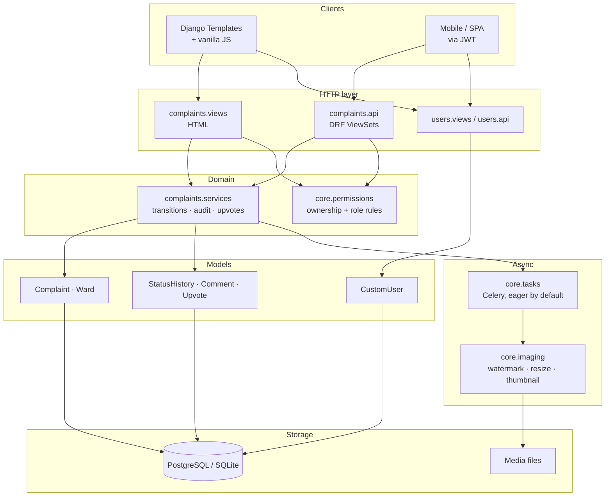

# NagrikSetu

<div align="center">
  <h1>NagrikSetu</h1>
  <p><em>Report it. Track it. Get it fixed.</em></p>
  <p>Citizen grievance management for municipal wards — Django, DRF, and a photo pipeline that stamps every report with where and when it was taken.</p>
</div>

## Table of Contents
- [Overview](#overview)
- [Features](#features)
- [Architecture](#architecture)
- [Technology Stack](#technology-stack)
- [Installation & Setup](#installation--setup)
- [Configuration](#configuration)
- [Project Structure](#project-structure)
- [API Documentation](#api-documentation)
- [Testing](#testing)
- [Deployment](#deployment)
- [Contributing](#contributing)
- [License](#license)

## Overview

A citizen photographs a pothole, an overflowing bin, or a dead streetlight. The
app captures their GPS position, watermarks the photo with the coordinates and
timestamp so it cannot be quietly reused later, and files it against a ward. The
corporator responsible sees it on a dashboard and a map, moves it through a
status workflow, and every move is written to an audit trail the citizen can
read. Both sides can talk on the complaint itself, and other residents can mark
"this affects me too" so the loudest problems surface on their own.

Everything the web app does is also available over a documented REST API, so a
mobile client can be built against the same rules.

## Features

### Complaint management
- File a complaint with a photo, GPS coordinates, landmark and issue type
- Eight issue categories, four priority levels, ward assignment
- Five-state workflow (Submitted → Seen → In Progress → Resolved / Rejected)
  with legal transitions enforced in one place, not scattered across views
- Append-only audit trail: who changed what, when, and with what note
- Comments between citizen and corporator, with official replies marked
- "This affects me too" upvotes, one per person, enforced by a DB constraint
- Photos watermarked with coordinates, timestamp and complaint ID; resized and
  thumbnailed automatically

### Access control
- Citizens see only their own complaints — enforced at the queryset, so the web
  view, the API and the map feed all inherit the same rule
- Corporators see everything and are the only role that can change status
- Role is server-assigned; it cannot be set through the signup form or the API
- POST-only sign out

### Discovery
- Search and filter by text, status, issue type and ward, with sorting
- Paginated card list with photo thumbnails
- Map view (Leaflet + OpenStreetMap) colour-coded by status
- Dashboard with status counts, resolution rate and an issue-type breakdown

### API
- Complaint, comment, upvote, status and ward endpoints as DRF ViewSets
- JWT and session authentication
- Pagination, filtering, search, ordering and throttling
- OpenAPI 3 schema with Swagger UI and ReDoc

### Operations
- `/healthz/` liveness probe that checks the database
- Request logging with a per-request trace ID returned in `X-Request-ID`
- Rotating log files, environment-split settings, deploy-check clean
- Optional Celery worker for image processing — falls back to inline when no
  broker is configured

## Architecture



**Why a service layer.** Status changes happen from four places: the dashboard,
the detail page, the REST API, and admin bulk actions. Putting the transition
rules, the audit row and the notification in `complaints/services.py` means all
four behave identically, and adding a fifth entry point cannot silently skip the
audit trail.

## Technology Stack

### Backend
- Python 3.13, Django 6.0
- Django REST Framework + SimpleJWT
- django-filter, drf-spectacular, django-cors-headers
- Pillow for the image pipeline
- Celery + Redis (optional)
- PostgreSQL in production, SQLite for local development

### Frontend
- Django templates
- Hand-written CSS design system (`static/css/app.css`) — no framework
- Vanilla JS for the mobile nav, toasts, lightbox, GPS capture and AJAX upvotes
- Leaflet + OpenStreetMap for the map

### Serving
- Gunicorn, WhiteNoise

## Installation & Setup

### Prerequisites
- Python 3.10+
- pip

### Steps

```bash
git clone <repository-url>
cd NagrikSetu

python -m venv venv
source venv/bin/activate        # Windows: venv\Scripts\activate

pip install -r requirements.txt

cp .env.example .env            # then edit SECRET_KEY
python manage.py migrate
python manage.py createsuperuser
python manage.py runserver
```

Open <http://localhost:8000>.

### Demo data

To get a populated app to click around in:

```bash
python manage.py seed_demo --reset --complaints 45
```

This creates 5 wards, 8 citizens and 3 corporators with complaints spread over
the last 90 days. Sign in as `asha.patil` (citizen) or `sunita.more`
(corporator) — password `demo1234`. The command refuses to run with
`DEBUG=False`.

### Optional: background image processing

Watermarking runs inline by default. To move it to a worker, set
`CELERY_BROKER_URL` in `.env` and run:

```bash
celery -A config worker --loglevel=info
```

## Configuration

Settings are split by environment and selected with `DJANGO_ENV`:

| Module | Selected by | Purpose |
| --- | --- | --- |
| `config.settings.dev` | `DJANGO_ENV=dev` (default) | Debug on, permissive hosts, relaxed throttles |
| `config.settings.prod` | `DJANGO_ENV=prod` | HSTS, SSL redirect, secure cookies, JSON-only API |
| `config.settings.test` | automatic under `manage.py test` | In-memory DB, fast hashing, silent logging |

All values come from the environment via `python-decouple`; see
[.env.example](.env.example) for the full list.

## Project Structure

```
NagrikSetu/
├── api/                    # API URL routing (router + JWT + docs)
├── complaints/
│   ├── api.py              # DRF ViewSets
│   ├── filters.py          # django-filter FilterSets
│   ├── forms.py            # Complaint, comment, status, filter forms
│   ├── models.py           # Complaint, Ward, StatusHistory, Comment, Upvote
│   ├── serializers.py      # List / detail / create serializers
│   ├── services.py         # Transitions, audit trail, stats — the domain rules
│   ├── views.py            # HTML views
│   ├── management/commands/seed_demo.py
│   └── templatetags/complaint_extras.py
├── config/
│   ├── celery.py
│   ├── settings/           # base · dev · prod · test
│   └── urls.py
├── core/
│   ├── imaging.py          # Watermark, resize, thumbnail
│   ├── middleware.py       # Request logging with trace IDs
│   ├── pagination.py
│   ├── permissions.py      # IsCorporator, IsOwnerOrCorporator
│   ├── tasks.py            # Celery tasks
│   └── views.py            # Healthcheck + error pages
├── users/
│   ├── api.py              # Register + profile endpoints
│   ├── forms.py
│   ├── models.py           # CustomUser with role and ward
│   └── views.py
├── static/{css,js}/
└── templates/
    ├── complaints/  users/  errors/  emails/  partials/
    └── base.html
```

## API Documentation

Interactive docs are served by the app itself:

| URL | What |
| --- | --- |
| `/api/docs/` | Swagger UI |
| `/api/redoc/` | ReDoc |
| `/api/schema/` | OpenAPI 3 schema (YAML) |

### Authentication

```bash
# Register
curl -X POST http://localhost:8000/api/auth/register/ \
  -H 'Content-Type: application/json' \
  -d '{"username":"asha","password":"Str0ng!Passphrase","password_confirm":"Str0ng!Passphrase"}'

# Obtain a token pair
curl -X POST http://localhost:8000/api/auth/token/ \
  -H 'Content-Type: application/json' \
  -d '{"username":"asha","password":"Str0ng!Passphrase"}'
```

Send the access token as `Authorization: Bearer <token>`.

### Endpoints

| Method | Path | Notes |
| --- | --- | --- |
| `GET` | `/api/complaints/` | Paginated; scoped to the caller's role |
| `POST` | `/api/complaints/` | File a complaint (status is server-controlled) |
| `GET` | `/api/complaints/{id}/` | Detail with comments and audit trail |
| `PATCH` | `/api/complaints/{id}/` | Owner while still Submitted, or any corporator |
| `POST` | `/api/complaints/{id}/status/` | Corporators only; validates the transition |
| `POST` | `/api/complaints/{id}/upvote/` | Toggles; returns the new count |
| `GET`/`POST` | `/api/complaints/{id}/comments/` | Read or add a comment |
| `GET` | `/api/complaints/{id}/history/` | Audit trail |
| `GET` | `/api/complaints/stats/` | Aggregate counts |
| `GET` | `/api/wards/` | Ward list |
| `GET`/`PATCH` | `/api/auth/me/` | Own profile (role is read-only) |

Filtering, search and ordering:

```
/api/complaints/?status=submitted&status=seen&issue_type=road
/api/complaints/?search=pothole&ordering=-upvote_count
/api/complaints/?ward=3&is_open=true&created_after=2026-01-01
/api/complaints/?page=2&page_size=50
```

## Testing

```bash
python manage.py test
```

89 tests covering models, the service layer, both sets of views, permissions and
the API. `manage.py test` selects `config.settings.test` automatically, so the
suite runs against an in-memory database in about a second.

The suite includes explicit regression tests for the bugs this codebase has
already had once:

- a citizen reading another citizen's complaint by walking the primary key
- an empty GPS field crashing complaint creation with `ValueError`
- sign-out happening on GET
- role escalation through the signup form and the profile API

## Deployment

The repo ships with a [render.yaml](render.yaml) blueprint, but any platform
that can run `build.sh` and Gunicorn will do.

```bash
DJANGO_ENV=prod
SECRET_KEY=<generated>
DEBUG=False
ALLOWED_HOSTS=your-domain.com
CSRF_TRUSTED_ORIGINS=https://your-domain.com
DATABASE_URL=postgres://…
```

Then:

```bash
./build.sh                                   # install, collectstatic, migrate
gunicorn config.wsgi --workers 3 --timeout 60
```

Point your platform's health check at `/healthz/`. Verify the hardening with:

```bash
DJANGO_ENV=prod python manage.py check --deploy
```

Uploaded media is served from local disk, which does not survive a redeploy on
ephemeral platforms — put it behind S3 or an equivalent before going live.

## Contributing

1. Fork and branch from `main`
2. Keep domain rules in `complaints/services.py` rather than in views
3. Add a test for anything you fix — especially permission boundaries
4. Run `python manage.py test` and `python manage.py check --deploy` before opening a PR

## License

Add a license file before publishing this repository.
