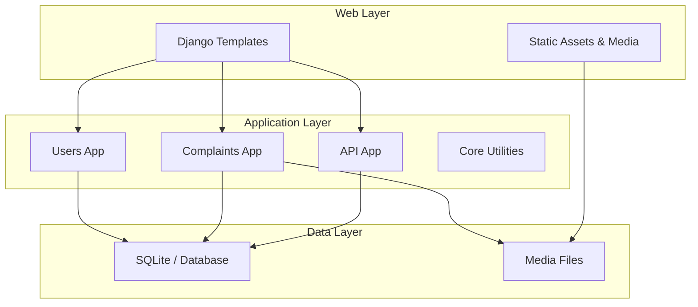

# NagrikSetu

<div align="center">
  <h1>NagrikSetu</h1>
  <p>Citizen grievance management system built with Django and Django REST Framework.</p>
</div>

## Table of Contents
- [Overview](#overview)
- [Features](#features)
- [Architecture](#architecture)
- [Technology Stack](#technology-stack)
- [Installation & Setup](#installation--setup)
- [Project Structure](#project-structure)
- [API Documentation](#api-documentation)
- [Contributing](#contributing)
- [License](#license)

## Overview

NagrikSetu is a web application for submitting and managing civic complaints. It provides user authentication, complaint creation, media uploads, and role-based views for different users.

## Features

### Complaint Management
- Create, update, view, and track complaints
- Attach media files to complaint records
- Store complaint details in the database

### User Access
- User signup and login
- Role-based access for citizens and corporator users
- Protected views using Django auth and decorators

### Dashboard & UI
- Template-based pages for complaint flow
- Complaint detail, list, and form screens
- Separate dashboard view for different user roles

### API Support
- Django REST Framework endpoints for complaint data
- Serializer-based validation for incoming requests
- URL routing through the `api/` app

## Architecture



## Technology Stack

### Backend
- Python
- Django
- Django REST Framework
- SQLite for local development

### Frontend
- Django templates
- HTML
- CSS
- JavaScript

### Supporting Components
- Media file handling
- Custom decorators and middleware
- Form and serializer validation

## Installation & Setup

### Prerequisites
- Python 3.10+
- pip

### 1. Clone the Repository

```bash
git clone <repository-url>
cd NagrikSetu
```

### 2. Create a Virtual Environment

```bash
python -m venv venv
```

Activate it:

```bash
# Windows
venv\Scripts\activate

# macOS / Linux
source venv/bin/activate
```

### 3. Install Dependencies

```bash
pip install -r requirements.txt
```

### 4. Run Database Migrations

```bash
python manage.py migrate
```

### 5. Create a Superuser

```bash
python manage.py createsuperuser
```

### 6. Start the Development Server

```bash
python manage.py runserver
```

## Project Structure

```text
NagrikSetu/
├── api/                 # API routing
├── complaints/          # Complaint models, views, forms, serializers
├── config/              # Project settings, URLs, ASGI/WSGI
├── core/                # Middleware and shared utilities
├── media/               # Uploaded complaint media
├── templates/           # Django templates
│   ├── complaints/
│   └── users/
├── users/               # Authentication and user management
├── manage.py            # Django management entry point
├── requirements.txt     # Python dependencies
└── README.md            # Project documentation
```

## API Documentation

The API routes are exposed through the `api/` app and use Django REST Framework serializers for validation. Refer to `api/urls.py` and the `complaints/serializers.py` file for request and response handling.

## Contributing

1. Fork the repository.
2. Create a feature branch.
3. Make focused changes.
4. Run the project locally and verify the affected flow.
5. Open a pull request.

## License

Specify the license you want to use for this project.
